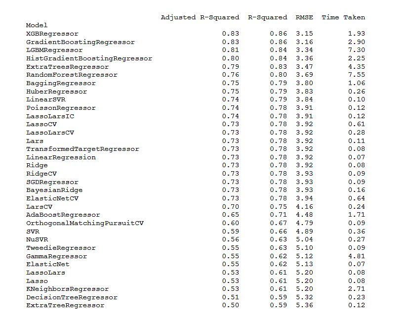

# AutoML - Machine Learning Automatizado


## Predecir el nivel de Riesgo Crediticio mediante Machine Learning Automatizado usando LazyPredict

La biblioteca LazyPredict de Python revoluciona el proceso de selección de modelos al crear una gran cantidad de modelos de aprendizaje automático sin mucho código y seleccionar automáticamente el mejor. Administra más de 40 modelos de clasificación y regresión, y proporciona métricas de rendimiento completas para una rápida decisión sobre cuál modelo utilizar, permitiendo ahorrar tiempo y recursos de cómputo.

Se ha utilizado esta biblioteca para encontrar el mejor modelo de machine learning para predecir el nivel de riesgo crediticio a asignar a las personas que solicitan un crédito bancario. La variable a predecir es “nivel de riesgo” (RiskScore).

## Leer la base de datos 
```
import os
import pandas as pd

df = pd.read_csv('credit_risk_36col_REGRESION.csv')
df.info()
```
## Importar el resto de las bibliotecas
```
from numpy import asarray
from numpy import mean
from numpy import std
from sklearn.datasets import make_regression
from sklearn.datasets import make_classification
from sklearn.model_selection import cross_val_score
from sklearn.model_selection import RepeatedKFold
from matplotlib import pyplot
```
## Extraer las variables target (y) y features (X) desde la base de datos
```
X = df.drop('RiskScore',axis=1)
y = df['RiskScore']
```
## Dividir la base de datos en los subconjuntos de entrenamiento y prueba
```
from sklearn.model_selection import train_test_split

X_train, X_test, y_train, y_test = train_test_split(X, y, test_size=0.20,
                                                          shuffle=False,
                                                          random_state = 1234)
```
## Inicializar y aplicar múltiples modelos
```
from lazypredict.Supervised import LazyRegressor # LazyClassifier
model = LazyRegressor(verbose=0, ignore_warnings=True)
models_train, predictions_train = model.fit(X_train, X_test, y_train, y_test)
```
## Mostrar métricas de desempeño para todos los modelos
```
print(models_train)
```
# RESULTADOS



## Conclusión

A partir del examen de los resultados del análisis es posible concluir que el método de machine learning que presenta el mejor desempeño para los datos es la regresión mediante XGBoosting. En efecto, dicho modelo presenta el mayor valor para el coeficiente de regresión múltiple ajustado (Adj R2=0.83) y a la vez el menor valor para la raíz del error cuadrático medio (RMSE=3.15).
